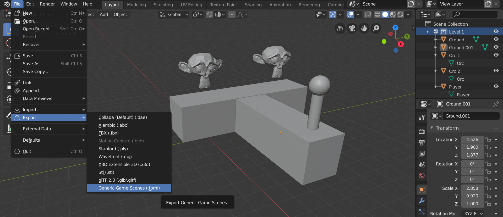

# Labyrinth 🏯

Looking for an generic scene editor for your game? Labyrinth allows you to take your 3d models, position them into a scene, and then export their names, position, location, and rotation to a simple file format to use in your game engine. 



Here's an example of the files this addon generates:

`game_scenes.toml`:
```toml
version=1
[Main]
file="scene_main.toml"
[Level 1]
file="scene_level_1.toml"
```

`scene_main.toml`:
```toml
name="Main"
[StartButton]
t="StartButton"
p=[0.0,0.0,0.0]
r=[0.0,0.0,0.0]
s=[1.0,1.0,1.0]
```

`scene_level_1.toml`:
```toml
name="Main"
[Orc 1]
t="Orc"
p=[0.5,0.5,0.0]
r=[0.0,0.0,0.0]
s=[1.0,1.0,1.0]
[Orc 2]
t="Orc"
p=[0.5,-5.0,0.0]
r=[0.0,0.0,0.0]
s=[1.0,1.0,1.0]
[Player]
t="Player"
p=[0.0,0.0,0.0]
r=[0.0,0.0,0.0]
s=[1.0,1.0,1.0]
```

Not to complex, yes?

*game_scenes.toml* - this is simply a file that keeps a version and list of known scene files.

*scene_{name}.toml* - this is a file that contains a list of entities.

**[{name}]** represents the objects name as per the object name in Blender. 

**t** represents the entity type, and is derived from the shared data name of an object in Blender.

**p** represents the entity position.

**r** represents the entity rotation.

**s** represents the entity scale.

# How to use?

1. Download `Labyrinth.py` from this project
2. Open up Blender 2.8
3. Edit -> Preferences 
4. Install Addon and look for `Labyrinth.py`
5. Hit the small little checkbox by the Labyrinth add-on to activate
6. Make some scenes and make some objects and give them meaningful names!
7. If you want multiple objects to share the same type (like a group of orcs), make sure to duplicate them with `Alt+D` so they share the same data name.
8. File -> Export -> Generic Game Scenes (.toml)
9. Choose a directory you want your scene files and manifest written to.
10. Load the scene into your engine using a TOML parser or a simple line by line parser.
11. When you find a new entity of a specific type, create an entity in your game with behavior your think appropriate.
12. Run your game!
